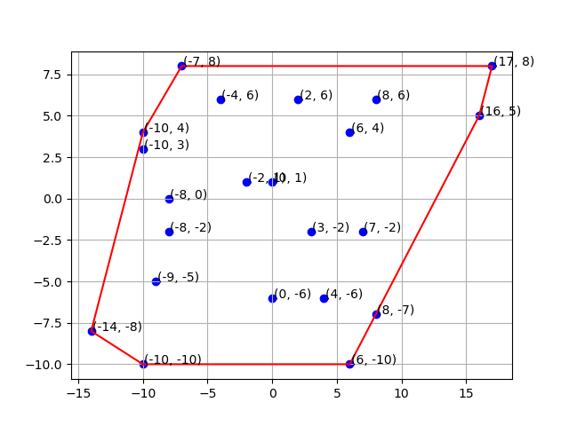

# Convex hull using Graham Scan



### Build

------

Just build the app using `make` 

```shell
make build
```


### Run

------

Run binary by supplying it with points. You can stream the resultant points to a file like `result.txt` 

```shell
./main.exe < points.txt > result.txt
# or
make run
```

If you just want to visualize the points, a Matplotlib viewer is available in the `draw.py` file

```shell
pip3 install matplotlib

python3 draw.py
# or 
make show
```

